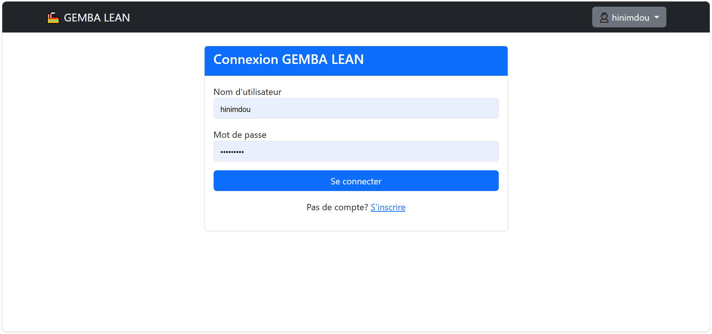
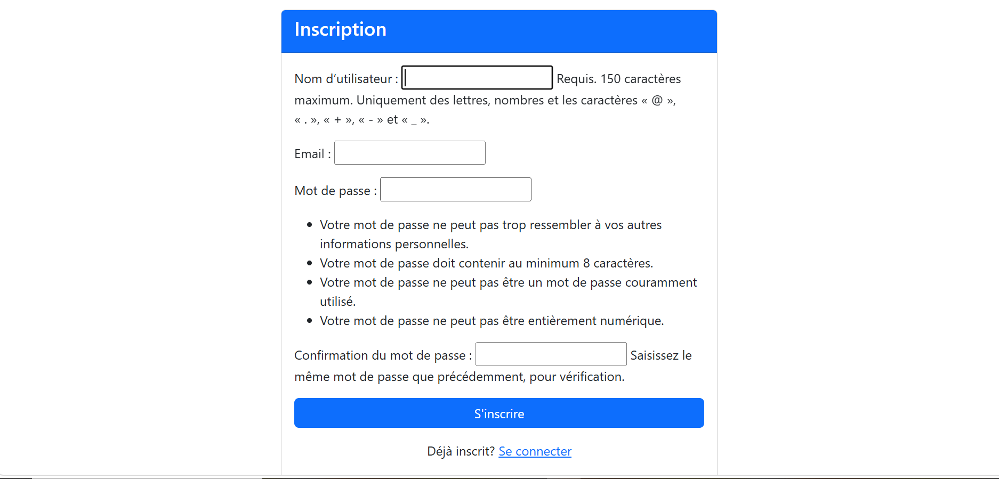

# GEMBA LEAN - Gestion de la Salle IATD (ENSAM Meknès)

##  **Introduction**
Le projet **GEMBA LEAN** est une application pratique s'inscrivant dans une démarche de **Lean Manufacturing**. Son objectif principal est de contribuer activement à l'aménagement et à l'optimisation de la salle "Intelligence Artificielle et Technologie de Données" (IATD) de l'**ENSAM Meknès**.

### **Le Problème**
La salle est partagée par trois niveaux d'étudiants (3ème, 4ème et 5ème année). Auparavant, l'absence de places fixes entraînait une gestion chaotique :
*   Installation d'applications de manière désordonnée.
*   Création de comptes utilisateurs multiples à chaque changement de poste.
*   Risque de suppression accidentelle des projets d'autres étudiants.
*   Usure du matériel difficile à suivre.

### **La Solution : Le "Gemba" (Le terrain)**
Fidèle à la philosophie Lean, ce projet n'a pas commencé devant un écran, mais sur le terrain (**Gemba**). Avant tout développement, une phase de travail physique a été nécessaire :
1.  **Audit technique :** Confirmation des chaises et ordinateurs fonctionnels.
2.  **Étiquetage :** Identification physique de chaque équipement.
3.  **Standardisation :** Attribution d'un binôme (Ordinateur + Chaise) unique à chaque étudiant pour instaurer une responsabilité et un suivi rigoureux.

##  **Intérêt de l'application**
*   **Organisation de la salle :** Une place pour chaque chose et chaque chose à sa place.
*   **Amélioration de la gestion :** Suivi en temps réel de l'état du matériel (Excellent, Bon, Cassé, etc.).
*   **Gain de temps :** Réduction du temps perdu par les étudiants et les professeurs lors de l'installation et du démarrage des séances.
*   **Maintenance préventive :** Système de signalement intégré pour corriger les anomalies dès leur apparition.

##  **Architecture du Projet**
Le projet suit une structure modulaire Django standard, complétée par des dossiers pour les médias et les logs.

### **Arborescence des Fichiers**
```text
GEMBA_LEAN/
├── GEMBA_LEAN/             # Dossier de configuration du projet
│   ├── settings.py         # Configuration (Base de données, Email, Auth)
│   ├── urls.py             # Routage global du projet
│   └── wsgi.py / asgi.py   # Interfaces serveurs
├── salle/                  # Application principale "Gestion de Salle"
│   ├── migrations/         # Historique des versions de la base de données
│   ├── forms.py            # Formulaires de saisie (Étudiants, Matériel)
│   ├── models.py           # Définition des entités (Chaise, PC, Étudiant)
│   ├── urls.py             # Routage spécifique à l'application salle
│   ├── utils.py            # Services utilitaires (Envoi d'emails)
│   └── views.py            # Logique métier et contrôleurs des vues
├── templates/              # Dossier des fichiers HTML (Django Templates)
│   ├── dashboard/          # Interfaces des tableaux de bord
│   ├── emails/             # Modèles d'emails (Bienvenue, Vérification)
│   └── registration/       # Pages de connexion et inscription
├── static/                 # Fichiers statiques (CSS, JavaScript, Images)
├── media/                  # Fichiers uploadés (Photos des PC/Chaises)
├── logs/                   # Journaux d'erreurs et de suivi d'emails
├── manage.py               # Script de gestion Django
├── requirements.txt        # Dépendances du projet
└── README.md               # Documentation
```


### **Logique MVT (Model-View-Template)**
L'application repose sur le framework Django et respecte le pattern suivant :

*   **Modèles (Base de données) :** 
    *   `Salle`, `Chaise`, `Ordinateur` : Représentation physique des ressources.
    *   `Etudiant` : Centralise les informations et les associations One-to-One avec le matériel.
    *   `Seance` & `OccupationSeance` : Gestion de l'historique d'utilisation de la salle.
    *   `RapportSalle` & `Signalement` : Outils de suivi Lean (Audit Gemba et remontée de problèmes).
    *   `EmailVerificationToken` : Sécurité accrue via la validation des comptes par email (UUID).
*   **Vues (Logique métier) :** Dashboards différenciés par profil (Administrateur, Responsable, Utilisateur) pour une gestion granulaire.
*   **URLs :** Structure de routage organisée par fonctionnalités (Auth, Admin, CRUD Équipements, API AJAX).

## **Technologies Utilisées**
*   **Langage :** Python 3.x
*   **Framework Web :** Django 4.2.7
*   **Gestion d'images :** Pillow 10.1.0
*   **Base de données :** SQLite (par défaut pour le développement) / Support PostgreSQL prêt.
*   **Frontend :** HTML5, CSS3, JavaScript (AJAX pour les interactions dynamiques).
*   **Sécurité :** Tokens UUID4 pour la vérification des emails.

## **Installation et Reproduction**
Si vous souhaitez cloner ce projet et le lancer localement :

1.  **Cloner le dépôt :**
    ```bash
    git clone <url-du-depot>
    cd GEMBA_LEAN
    ```

2.  **Créer un environnement virtuel :**
    ```bash
    python -m venv venv
    # Sur Windows
    venv\Scripts\activate
    # Sur Linux/Mac
    source venv/bin/activate
    ```

3.  **Installer les dépendances :**
    ```bash
    pip install -r requirements.txt
    ```

4.  **Appliquer les migrations :**
    ```bash
    python manage.py makemigrations
    python manage.py migrate
    ```

5.  **Créer un super-utilisateur (Admin) :**
    ```bash
    python manage.py createsuperuser
    ```

6.  **Lancer le serveur :**
    ```bash
    python manage.py runserver
    ```
    Accédez ensuite à l'application via `http://127.0.0.1:8000`.

##  **Démonstration de l’application**

Lorsque vous lancez votre application pour la première fois, vous serez redirigé vers la page de connexion suivante.  
Si vous ne disposez pas encore d’un compte, il faudra alors en créer un en remplissant le formulaire d’inscription.

Une fois les informations renseignées, un e-mail de confirmation vous sera envoyé afin de valider votre compte.  
Après confirmation, vous pourrez vous connecter à l’application.

|  Interface de connexion |  Interface d’inscription |
|---|---|
|  |  |

## **Contributeurs**
*   **Hinimdou Morsia Guitdam** — Élève ingénieur IA & Technologie des Données
*   **Nankouli Marc Thierry** — Élève ingénieur IA & Technologie des Données

---
*Projet réalisé dans le cadre de l'amélioration continue (Kaizen) de l'ENSAM Meknès.*
